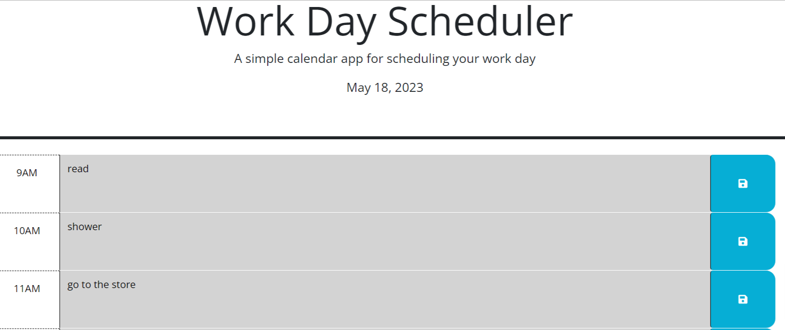

# work-day-scheduler

## Description

The Work Day Scheduler is a simple web app that allows the user to enter and save events in a business-hour calendar. The project utilizes third-party API's (jQuery and bootstrap) as well as the Day.js library to dynamically color code time blocks to show the past, present, and future hours depending upon the current time of day. The entered events are saved to local storage so that they remain on the calendar even after refreshing the page and can be changed at any time.

[work-day-scheduler](https://codehashira28.github.io/work-day-scheduler/)

## Installation

N/A

## Usage

The work day scheduler opens with a project heading for the app and the current date displayed underneath in 'MMM DD YYYY' format. Regular day business hours (9AM-5PM) are then shown below and color coded to reflect past (gray), present(red), and future(green) hours based on the current hour of the day. The user can enter an event in any time block and click the blue save button located on the end of each time block to save the event to local storage. Once done, the user can refresh the page and the events will remain on the calendar.

## Credits

Starter code in initial commit of "added files" provided by organization/program.